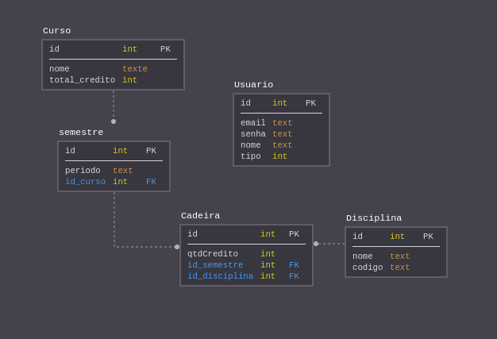

# Realizado

<ul> 
  <li>Backend Completo</li> 
  <li>Frontend, realizado somente Login</li> 
</ul>

# Tecnologias ultilizadas
<ul> 
  <li>Spring Boot 2.2.4</li> 
  <li>java 8</li>
  <li>Postgres12</li>
  <li>React16</li>
</ul>

# Suposições realizadas
 atutenticação é feita por email e senha.
 
 As relações Suposta entre entidades são: 
    <ul>
    <li>Curso possui muito semestres</li>
    <li>Semestre possui um curso e muitas cadeiras</li>
    <li>Cadeira possui um semestre e uma disciplina</li>
    <li>Disciplina possui muitas cadeiras</li>
    <li>A entidade Usuario não possui relacionamentos</li>
    </ul>
   
# Esquema do banco

# Rodar as aplicações
 
 Backend 
    <ul>
    <li>Nescessario IDE com suporte ao Spring Boot</li>
    <li>JDK 8</li>
    <li>Postgres 12</li>
    <li>Nescessario criação de um banco local no postgres</li>
    <li>Na arquivo "src/main/resources/application.properties" possui as configurações do postgres</li>
    <li>Agora é só rodar a aplicação</li>
    <li>Formato dos posts podem ser encontrados no README.md da pasta backend</li>
    </ul>
  
 Frontend 
    <ul>
    <li>Necessario o NPM</li>
    <li>Abra o terminal na pasta do projeto e execute o camando npm start</li>
    </ul>
